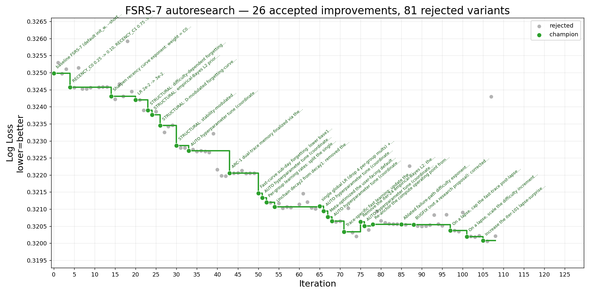

# fsrs-autoresearch
Improving FSRS-7 with Claude. This repo was inspired by AlphaEvolve and [Andrej Karpathy's "autoresearch" repo](https://github.com/karpathy/autoresearch). Also check out [my other autoresearch repo](https://github.com/Expertium/fsrs-rs-speed-autoresearch). 

Huge thanks to [1DWalker](https://github.com/1DWalker), without [his code](https://github.com/open-spaced-repetition/fsrs-gpu-benchmark) this wouldn't be possible!

Below is a graph that shows how log loss (average across 3000 Anki users) changed as Claude kept working on it.



You can find more details in history.md and history.jsonl. Some notes:
1) Not all proposals came from Claude, for example, using 4 different values of learning rate was my idea. Though I discarded it later.
2) What counts for the complexity score has been changed multiple times, so that number is mostly worthless.
3) This repo also contains code to find [optimal user-facing default parameters for FSRS-7](https://github.com/Expertium/fsrs-autoresearch/blob/main/src/autoresearch/central_diff_init_w.py) and an [automated hyperparameter tuner](https://github.com/Expertium/fsrs-autoresearch/blob/main/src/autoresearch/hp_tune.py). (An earlier version split the defaults into two separate tuples — a user-facing default and a separate SGD "starting point" — but that didn't help: tuning the starting point separately reduced log loss only within the noise floor, so there's a single default set.)
4) The CUDA code here optimizes all 3000 users *jointly*, but the real optimizer (FSRS-rs) optimizes one user at a time. It was my oversight not to make *"don't do things that exploit the way the CUDA code jointly optimizes all users"* an explicit constraint. The one accepted change that exploits it is the empirical-Bayes L2 (iter 24): it shrinks each user toward the live population mean, which does nothing for a single user (it degrades to the old default-anchored L2). It's worth only ~0.0001 log loss, so no real harm — but in hindsight it shouldn't have counted.
5) There are several times when log loss went up, that was either me or Claude reverting changes that were cheating or otherwise undesirable.

---

## What this is, in one paragraph

[FSRS](https://github.com/open-spaced-repetition/fsrs4anki) is the spaced-repetition model Anki uses to schedule reviews. This repo runs an **autoresearch loop**: each iteration, Claude reads the current best model ("champion"), proposes **one** change (a new formula, a new state variable, a training-loop tweak), trains it on 3000 real Anki users' review histories on the GPU, scores it, and **keeps the change only if it beats the champion by a fixed margin** — otherwise it reverts. Over a couple hundred iterations the champion slowly improves. Everything the loop has tried is logged in `result/history.md` / `result/history.jsonl`.

## The metric

- **`logloss_by_user` (primary)** — average log loss where each of the 3000 users counts equally (heavy users can't dominate). This is the *only* number that decides accept/reject.
- **`logloss_by_review` (sanity)** — average over every review; heavy users dominate. Reported, not decisive.

Lower is better. The model predicts a recall probability `p(Δt)` (a forgetting curve); log loss scores those probabilities against what actually happened (recalled / forgot).

## How one iteration works

1. Read the champion: `result/diagnostics.md` (last accepted run) + `result/history.md`.
2. Propose **one** change and write the patch — the model math in `src/main/csrc/fsrs/fsrs7.{cu,cuh}`, or the Python training loop / constants.
3. Run it: `docker compose --progress quiet run --rm srs-benchmark bash src/main/run.sh` (~100 s on an RTX 4070; trains 8 epochs over 3000 users / 152 M reviews, then evaluates).
4. Read `result/diagnostics.json`; compare `logloss_by_user` to the champion.
5. **Accept** (commit + tag → new champion) iff the improvement clears the threshold below *and* the complexity gate; otherwise **revert** and record the rejection.

## Acceptance rules

A change is accepted only if `champion_logloss − new_logloss ≥ threshold`:

| Change | Threshold contribution |
|---|---|
| Each new state variable | +0.0010 |
| Each new trainable parameter | +0.0002 |
| Any other change (formula / training tweak) | +0.0001 (the floor) |
| Pure simplification (only removing params) | 0.0000 (must merely not be worse) |

Adding a new state variable/parameter **AND** simultaneously removing old parameter(s) lowers the threshold by 0.0002 for each removed parameter, but not below 0.0002.

Plus a **complexity gate**: `score = AST_nodes + 40·cyclomatic`, measured over the editable files (Python *and* the CUDA model); an accepted change may raise it by ≤5%. This stops the model from accreting clever-but-unjustified machinery. (As note 2 says, the complexity baseline has been redefined a few times.)

There are also **12 hard constraints** every variant must satisfy — the forgetting curve must stay monotonic / convex / pinned at `p(0)=1` and `p(∞)→0`; higher difficulty must not speed up memory; no eval→train leakage; everything stochastic seeded; etc. The full set, plus the exact threshold and complexity details, lives in **[`CLAUDE.md`](CLAUDE.md)** — that file is the actual design document and the source of truth for the rules.

## Repo layout (the parts that matter)

```
src/
  main/
    csrc/fsrs/fsrs7.cu, fsrs7.cuh   # ★ the FSRS-7 model forward pass (LLVM 18 + Enzyme CUDA)
    fsrs/fsrs_v7_constants.py       # init_w defaults, clamps, L2 sigmas, LR / betas / recency
    fsrs/fsrs_v7_helpers.py         # L2 penalty, recency weighting, parameter clipper
    fsrs/fsrs_v7_optimizer.py       # Adam / AdamW update
    fsrs/fsrs_v7_scheduler.py       # LR schedule
    run.py, run.sh                  # train + evaluate one variant
    config.py                       # N_EPOCHS, BATCH_SIZE, dataset-size asserts
  autoresearch/
    history.py                      # append_iteration() -> history.{jsonl,md}
    diagnostics.py                  # the per-iteration report
    complexity.py                   # the complexity score (Python + Rust/CUDA)
    hp_tune.py                      # automated hyperparameter tuner (below)
    central_diff_init_w.py          # default-parameter meta-optimizer (below)
result/
  history.jsonl, history.md         # ★ append-only record of every iteration (source of truth)
  diagnostics.json, diagnostics.md  # the latest run's full report
CLAUDE.md                           # ★ the design doc: constraints, thresholds, workflow
```

## Running it

Requires Linux, or Windows + WSL, with Docker, and a CUDA GPU (compute capability ≥ 8.6). Everything runs in Docker because the FSRS-7 forward pass is a custom CUDA extension built with LLVM 18 + Enzyme (for autodiff); native builds aren't supported.

Prepare the dataset (one-time):
```sh
docker compose --progress quiet run --rm srs-benchmark python -m src.prepare.prepare --processes 10
```
(If you hit `concurrent.futures.process.BrokenProcessPool` on WSL, raise the memory cap in [`.wslconfig`](https://learn.microsoft.com/windows/wsl/wsl-config) or lower `--processes`.)

> **About the dataset.** `anki-revlogs-3k` (the `--data` default) is just the **first 3,000 users** of the public 10k-user [`anki-revlogs-10k`](https://github.com/open-spaced-repetition/anki-revlogs-10k) dataset — equivalent to taking the full 10k set with **`--max-user-id 3000`**. Note that `--max-user-id` is a flag of the **`prepare`** step (`src/prepare/prepare_config.py`), i.e. Python-side preprocessing — the CUDA model itself never sees it; it just trains on whatever `prepare` wrote out.

Train + evaluate one variant:
```sh
docker compose --progress quiet run --rm srs-benchmark bash src/main/run.sh
```

## Beyond the loss loop

Two pieces of automation live alongside the main loop:

- **`src/autoresearch/hp_tune.py`** — an automated *hyperparameter* tuner. Nudging numeric training knobs (learning rate, Adam betas, L2 strength, recency weighting) by hand is mechanical, so this runs a greedy coordinate-descent search over them, keeps any config that beats the champion by the 0.0001 floor, commits it, and tags it. Editing numeric literals doesn't change the AST, so these tweaks are complexity-neutral. Run from the host: `python src/autoresearch/hp_tune.py`.
- **`src/autoresearch/central_diff_init_w.py`** — a meta-optimizer for the model's **user-facing default parameters** (note 3 above): the static defaults applied directly, with no per-user training, to someone with little review history. It uses Adam with central-difference (black-box) gradients to minimize `logloss_by_user` at those defaults. (The script can also optimize a *separate* SGD starting point — the `recency` phase — but that split was tested and abandoned, see the comment in the file; the phase is kept for reference, gated off by default.)

## Continuing this work (humans and AIs)

If you're picking this up:

1. **Read [`CLAUDE.md`](CLAUDE.md) first.** It is the full design doc: the metric, the 12 hard constraints, the exact threshold + complexity-gate formulas, the mutation surface (which files you may edit), and the per-iteration workflow + pre-submission checklist. Several "obvious" ideas are explicitly ruled out there (e.g. a learned recall floor/ceiling breaks the forgetting-curve endpoints), so read it before proposing anything.
2. **Read `result/history.md`** — the running log of everything tried and why it was accepted or rejected, so you don't re-run dead ends. The current champion is simply the most recent `accepted` record.
3. **One change per iteration.** Bundling two ideas makes the delta unattributable. Run it, compare `logloss_by_user` to the champion, accept/reject against the threshold, and append a record via `src.autoresearch.history.append_iteration`.
4. The model itself is the CUDA forward pass in `src/main/csrc/fsrs/fsrs7.{cu,cuh}`; the Python side owns training. Both are scored by the complexity gate, so you can't dodge it by moving logic between them.

The campaign has been long (150+ iterations) and most bold structural bets **reject** — that's normal and expected; a rejection still maps the loss surface and rules out a hypothesis. The wins are small and hard-won (see the graph at the top).
